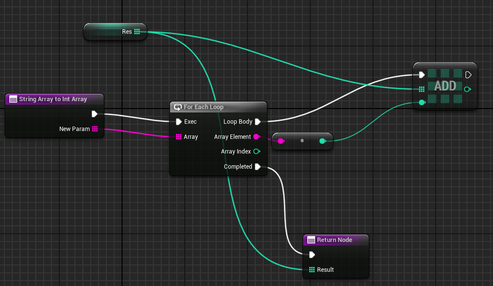
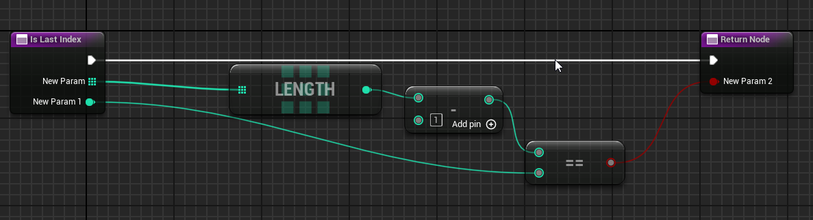
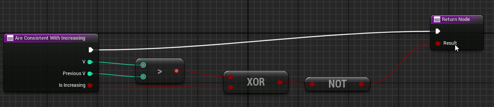
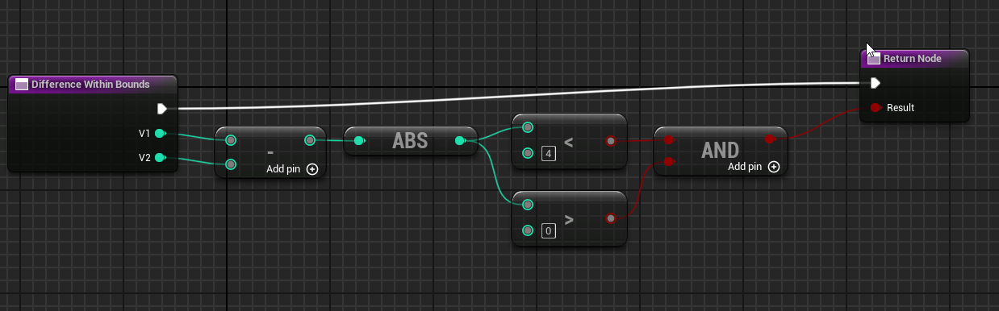
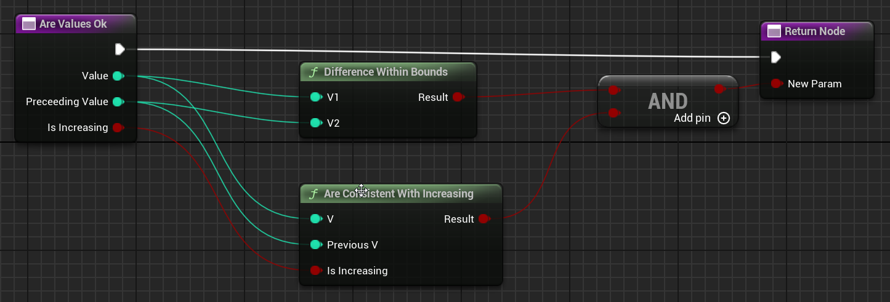
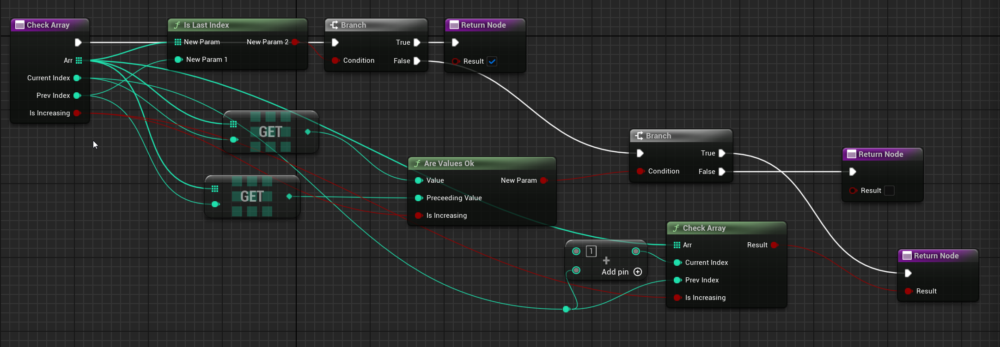
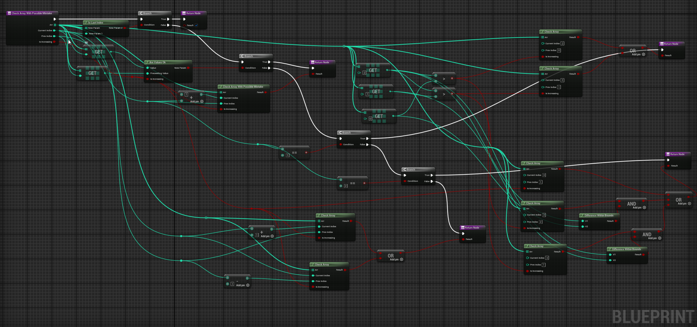
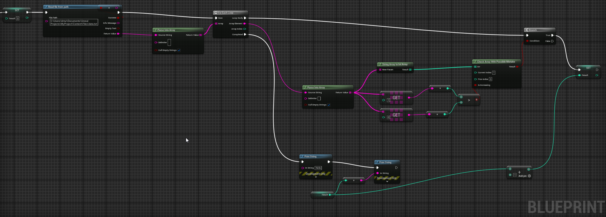

:::warning
Potential spoilers regarding part 2 of the aforementioned AoC puzzle.
:::

https://adventofcode.com/2024/day/2

As a reminder to anyone who does not remember AoC puzzles by heart: this day's puzzle required us to create code that would count how many lines in the text file contained "safe" reports. A report was an array of positive integers and the safe ones were the ones that were [monotonic](https://en.wikipedia.org/wiki/Monotonic_function) and whose consecutive values differed by at least 1 and at most 3. That's it for part 1 of this day.

For part 2 we needed to broaden the definition of safeness to include those unsafe reports that would be safe after removal of exactly one element.

My boring and surely suboptimal solution in python can be found in my [Advent of Code repo](https://github.com/Vulwsztyn/advent-of-code/blob/main/2024/day02/main.py).

What follows are the screenshots including the recreation of the code in that repo in Unreal blueprints and the prolog code I decided on writing after having started writing this post.

# Convenience functions
- String Array To Int Array


- Is Last Index


- Are Consistent With Increasing


- Difference Within Bounds


- Are Values Ok


For prolog I took the suboptimal route of using code reading from file straight from stackoverflow answer so instead of array of ints I had an array of char, so I needed to parse that. Because I didn't need to deal with the wacky mathematics of parsing from right to left (i.e. keeping track of what power of 10 should current digit be multiplied by) I needed to use `append/3` predicate instead of native prolog split of `[Head|Tail]`:
```prolog
parse_line([],[0]).
parse_line(List, Result) :- 
    append(Init, [' '], List),
    parse_line(Init, PartialResult),
    append(PartialResult, [0], Result),
    !.
parse_line(List, Result) :- 
    append(Init, [Last], List),
    parse_line(Init, PartialResult),
    append(InitP, [LastP], PartialResult),
    char_code(Last, Code),
    NewLastP is LastP*10+Code-48,
    append(InitP, [NewLastP], Result), 
    !.

diff_within_range(X, Y) :-
    AbsDiff is abs(X - Y),  
    AbsDiff > 0,            
    AbsDiff < 4. 
```

the `parse_line/2` predicate is equivalent to the python code:

```python
def parse_line(line: str) -> list[int]:
    if not line:
        return [0]
    if line[-1] == " ":
        return parse_line(line[:-1]) + [0]
    partial_result = parse_line(line[:-1])
    init = partial_result[:-1]
    last = partial_result[-1]
    return init + [last * 10 + int(line[-1])]
```

# Part 1

Now the actual code. For the first part it is simple enough. I created a recursive function going over consecutive pairs of indexes (I see now that I can make it simpler, because the previous index in this function is always `current index - 1`) until it reaches the last index. The function is a classic example of a "helper" function i.e. the one doing all the work and the actual function only calls it with proper initial arguments - in this case `IsIncreasing` value.

- Check Array


in Prolog:
```prolog
check_report_helper([_],_).
check_report_helper([H1,H2|T], IsIncreasing) :- 
    (H1 < H2 -> IsIncreasing = true ; IsIncreasing = false), 
    diff_within_range(H1,H2), 
    check_report_helper([H2|T], IsIncreasing).


check_report([H1,H2|T]) :- 
    (H1 < H2 -> Order = true ; Order = false), 
    check_report_helper([H1,H2|T], Order).
```

in python:
```python
def is_array_ok_helper(arr, i, prev_i, is_increasing):
    if i >= len(arr):
        return True
    if not within_bounds(arr[i], arr[prev_i]) or not consistent_with_increasing(
        arr[i], arr[prev_i], is_increasing
    ):
        return False
    return is_array_ok_helper(arr, i + 1, i, is_increasing)


def is_array_ok(arr):
    return is_array_ok_helper(arr, 1, 0, arr[1] > arr[0])
```

# Part 2

Now for the second part code and "code" are a tad more complicated as they need to account for the possibility of report being safe despite one element seemingly making it unsafe.

This time I didn't need to go against the grain in Prolog and use `append`, so the recursion goes from the whole array left to right.

```prolog
check_report_with_mistake_helper([_,_],_).
check_report_with_mistake_helper([H1,H2|T], IsIncreasing) :-
     (H1 < H2 -> IsIncreasing = true ; IsIncreasing = false), 
    diff_within_range(H1,H2), 
    check_report_with_mistake_helper([H2|T], IsIncreasing),
    !.
check_report_with_mistake_helper([H1,_|T], IsIncreasing) :-
    check_report_helper([H1|T], IsIncreasing), !.
check_report_with_mistake_helper([H1,_,H3|T], IsIncreasing) :-
    check_report_helper([H1,H3|T], IsIncreasing), !.

check_report_with_mistake([H1,H2|T]) :- 
    (H1 < H2 -> IsIncreasing = true ; IsIncreasing = false), 
    check_report_with_mistake_helper([H1,H2|T], IsIncreasing), 
    !.
check_report_with_mistake([_,H2,H3|T]) :- 
    (H2 < H3 -> IsIncreasing = true ; IsIncreasing = false), 
    check_report_helper([H2,H3|T], IsIncreasing), 
    !.
check_report_with_mistake([H1,_,H3|T]) :- 
    (H1 < H3 -> IsIncreasing = true ; IsIncreasing = false), 
    check_report_helper([H1,H3|T], IsIncreasing), 
    !.
```

`check_report_with_mistake` "is true" in either of the 3 scenarios (if everything is ok besides that):
- mistake is somewhere further than 1st 2 elements
- mistake is the 1st element
- mistake is the second element

Since the possibility of mistake is "exhausted" is the latter 2 options it uses the helper function that doesn't allow for mistakes, but `IsIncreasing` needs to be recalculated, because the removed element no longer influences it.

`check_report_with_mistake_helper` also has 3 possibilities of being "true":
- there was no mistake and recursion arrived at 2 last elements - in this case we do not care if there is a mistake or not
- everything is ok with the 1st two elements, recursion proceeds using helper with possibility of mistake
- something is wrong with the current pair of the 1st two elements - in this case 2 subscenarios are checked: 
    - removal of the 1st element
    - removal of the 2nd element

I took a bit different approach when "writing" blueprint code and I see now that it could be simplified to be tantamount to the Prolog one:

- Check Array with Mistake


Here the helper function checks all the scenarios:
- If we have achieved the last index everything is ok
- If the elements "under" the current pair of indexes are ok recursion proceeds normally
- If not 3 cases are checked:
    - If the current pair of indexes were `0` & `1` it is checked if report without either of those would be safe with recalculation of `IsIncreasing`
    - If the current pair of indexes were `1` & `2` it is checked if removal of element indexed `0`, `1`, or `2` would result in a safe report - the former two cases with recalculation of `IsIncreasing`, and check whether the pair of 1st elements of the array (under indexes `1` & `2` and `0` & `2` respectively) has a difference within bounds
    - otherwise it is checked if removal of either current or previous element would result in a safe report - without `IsIncreasing` recalculation

the blueprint code in equivalent to python:

```python
def is_array_ok_with_mistake_helper(arr, i, prev_i, is_increasing):
    if i >= len(arr) - 1:
        return True
    is_ok = within_bounds(arr[i], arr[prev_i]) and consistent_with_increasing(
        arr[i], arr[prev_i], is_increasing
    )
    if is_ok:
        return is_array_ok_with_mistake_helper(arr, i + 1, i, is_increasing)
    if i == 1:
        return is_array_ok_helper(
            arr, 2, 0, arr[2] > arr[0]
        ) or is_array_ok_helper(arr, 2, 1, arr[2] > arr[1])
    if i == 2:
        return (
            is_array_ok_helper(arr, 3, 1, is_increasing)
            or (
                within_bounds(arr[2], arr[0])
                and is_array_ok_helper(arr, 3, 2, arr[2] > arr[0])
            )
            or (
                within_bounds(arr[2], arr[1])
                and is_array_ok_helper(arr, 3, 2, arr[2] > arr[1])
            )
        )
    return is_array_ok_helper(
        arr, i + 1, prev_i, is_increasing
    ) or is_array_ok_helper(arr, i, prev_i - 1, is_increasing)


def is_array_ok_with_mistake(arr):
    return is_array_ok_with_mistake_helper(arr, 1, 0, arr[1] > arr[0])
```

# Connecting in all

- Main Loop


That's how the main loop looks for part 2. It is just a simple accumulation after splitting the text of the `txt` file with input into an array of arrays of integers. You might notice that the delimiter in first split needs to be an actual carriage return char not `\n`.

In prolog the logically outermost code looks like this:
```prolog
check_reports([],0).
check_reports([H|T],X):-
    check_report(H),
    check_reports(T,X1),
    X is X1+1,
    !.
check_reports([_|T],X) :- check_reports(T,X).

check_reports_with_mistake([H|T],X):-
    check_report_with_mistake(H),
    writeln(H),
    check_reports_with_mistake(T,X1),
    X is X1+1,
    !.
check_reports_with_mistake([_|T],X) :- check_reports_with_mistake(T,X).


main :- phrase_from_file(lines(Lines), 'test.txt'), 
    parse(Lines, Parsed),
    check_reports(Parsed, NumberOfOk),
    writeln(NumberOfOk),
    check_reports_with_mistake(Parsed, NumberOfOkWithMistake),
    writeln(NumberOfOkWithMistake).
```

Which one is more cursed you can decide for yourselves.
